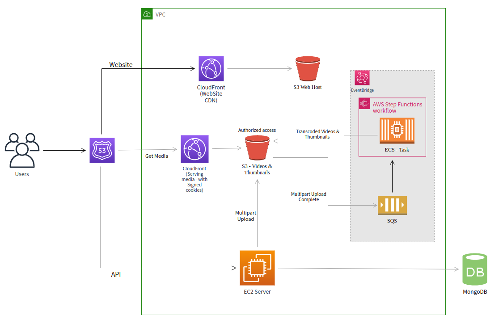

# VPlayer
  - Signup and upload videos (public)
  - Uploading in chunks and as Multipart upload to S3
  - On-demand video Transcoding
  - Thumbnail Generation
  - Supports Adaptive Bitrate Streaming (ABS) in HLS format
  - Resource (Video, thumbnails, etc.) authorization with Signed cookies from private S3
  - Follows best security practices

## Architecture Overview

## Tech used
  - React.js
  - Node.js
  - FFmpeg
  - MongoDB
  - Docker
  - AWS 
    - S3, CloudFront, EC2
    - EventBridge, SQS, ECR, ECS, Step Functions

### Checkout Backend and Transcoder Repos
  - [Backend](https://github.com/harikumarDev/backend-vplayer)
  - [Transcoder](https://github.com/harikumarDev/video-transcoder)
